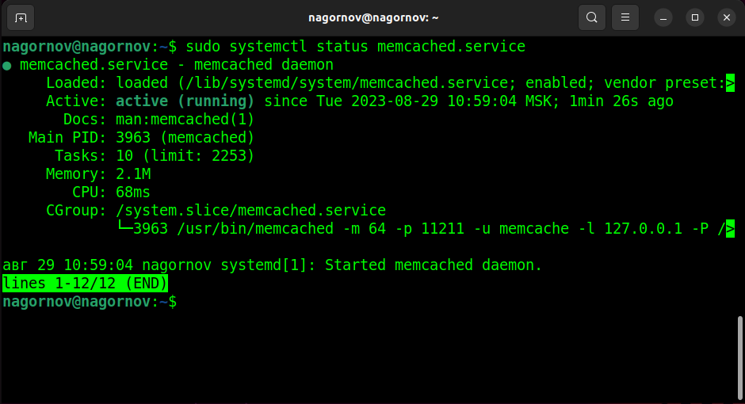
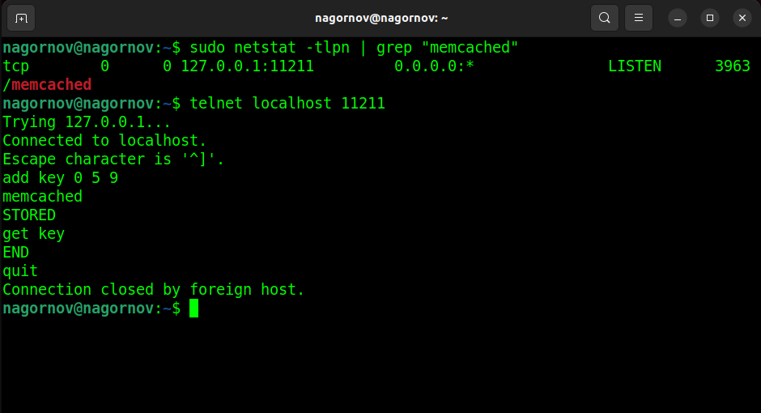
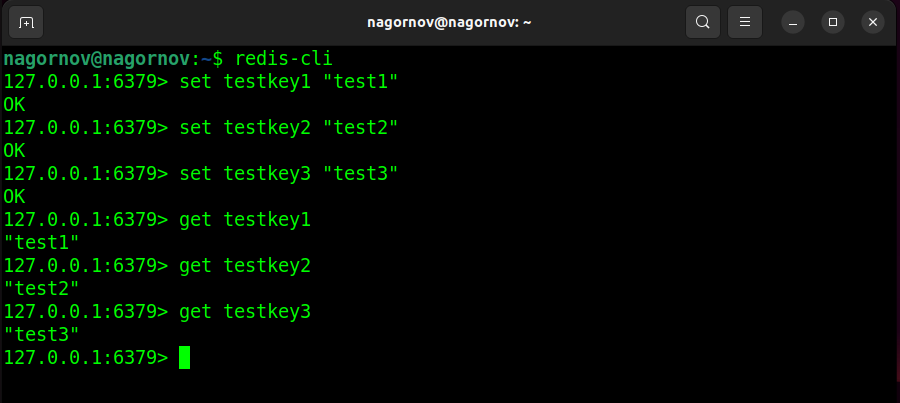
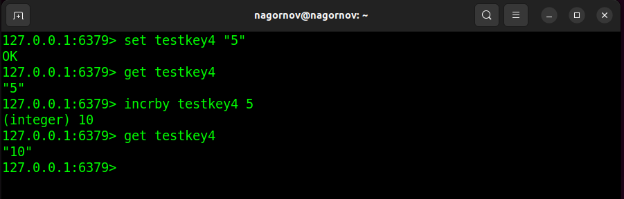

# Домашнее задание к занятию "Кеширование Redis/Memcached" - `Нагорнов Антон Алексеевич`

### Задание 1

- Повышение производительности;  
- Увеличение скорости ответа;  
- Экономия ресурсов базы данных, например, применяя кэширование тяжелых запросов;  
- Сглаживание роста трафика. Использование кэша, чтобы сгладить резкое увеличение трафика.  

### Задание 2

### Задание 3

### Задание 4

### Задание 5*

